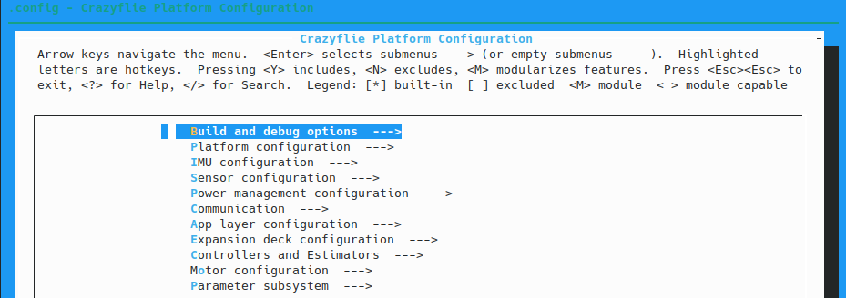
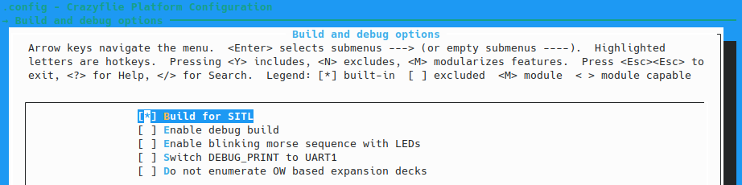
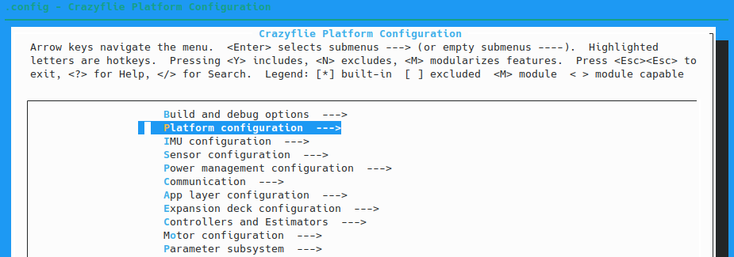
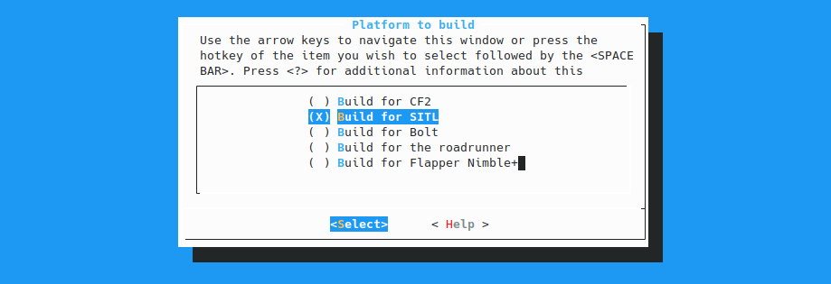
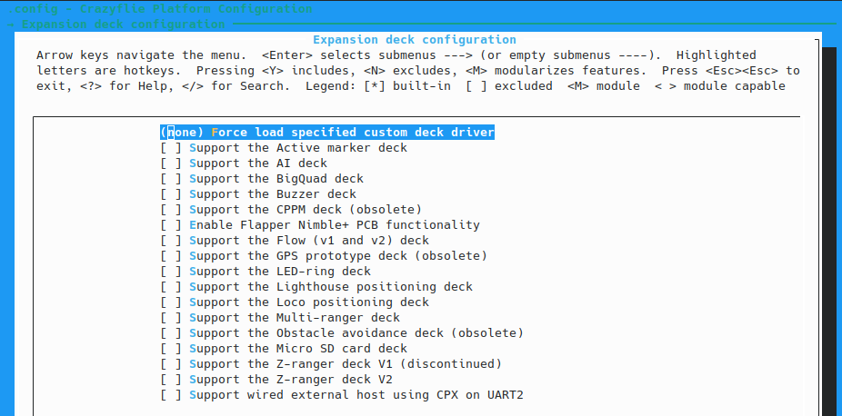
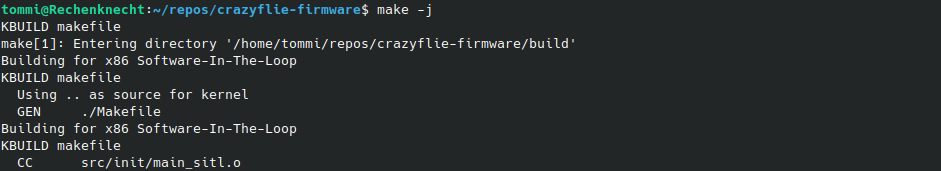

# Crazyflie Firmware for sim_cf2 SITL

This fork of the Crazyflie firmware contains modifications for software-in-the-loop simulation with the ROS2 Gazebo *sim_cf2* Crazyflie Flight Simulator. It is utilizing the FreeRTOS Linux Port https://www.freertos.org/FreeRTOS-simulator-for-Linux.html#SimulatorApp

The build process is fully integrated into the firmware's KBuild build system allowing the use of the same code base for simulation and execution on the real Crazyflie based on the configuration.

## Dependencies

The firmware for SITL is built using the systems default C/C++ compiler. KBuild requires some additional packages

```sh
sudo apt install make build-essential libncurses5-dev
```

If you haven't done already, make sure all submodules are up to date. The SITL requires the FreeRTOS repository with the Linux Port which isn't part of the original crazyflie-firmware repository.

```sh
git submodule update --init --recursive
```

Download the newest version of GNU Scientific Library (GSL) from their website https://www.gnu.org/software/gsl/#downloading


Get the tarball with the newest version


Unpack the archive and move into the gsl folder. Run the configure script

```sh
./configure
```

Build the library

```sh
make -j
```

Install the library on your system

```sh
sudo make install
```

Run ldconfig

```sh
sudo ldconfig
```

## Building for SITL

Open a terminal and move into the crazyflie-firmware repository (assuming ~/repos/crazyflie-firmware) and configure the build

```sh
cd ~/repos/crazyflie-firmware
```

```sh
make menuconfig
```

### Configure the Build

In the gui interface of *menuconfig* first navigate to *Build and debug options*



Select *Build for SITL*



Switch to *Platform configuration*



Select *Build for SITL* in the *Platform to build* window



In the menu entry *Expansion deck configuration* make sure no decks are activated



Save the configuration file and exit *menuconfig*

### Build the Firmware

Run make

```sh
make -j
```




# Crazyflie Firmware  [](https://github.com/bitcraze/crazyflie-firmware/actions?query=workflow%3ACI)

This project contains the source code for the firmware used in the Crazyflie range of platforms, including the Crazyflie 2.X and the Roadrunner.

### Crazyflie 1.0 support

The 2017.06 release was the last release with Crazyflie 1.0 support. If you want
to play with the Crazyflie 1.0 and modify the code, please clone this repo and
branch off from the 2017.06 tag.

## Building and Flashing
See the [building and flashing instructions](https://github.com/bitcraze/crazyflie-firmware/blob/master/docs/building-and-flashing/build.md) in the github docs folder.


## Official Documentation

Check out the [Bitcraze crazyflie-firmware documentation](https://www.bitcraze.io/documentation/repository/crazyflie-firmware/master/) on our website.

## Generated documentation

The easiest way to generate the API documentation is to use the [toolbelt](https://github.com/bitcraze/toolbelt)

```tb build-docs```

and to view it in a web page

```tb docs```

## Contribute
Go to the [contribute page](https://www.bitcraze.io/contribute/) on our website to learn more.

### Test code for contribution

To run the tests please have a look at the [unit test documentation](https://www.bitcraze.io/documentation/repository/crazyflie-firmware/master/development/unit_testing/).

## License

The code is licensed under LGPL-3.0
